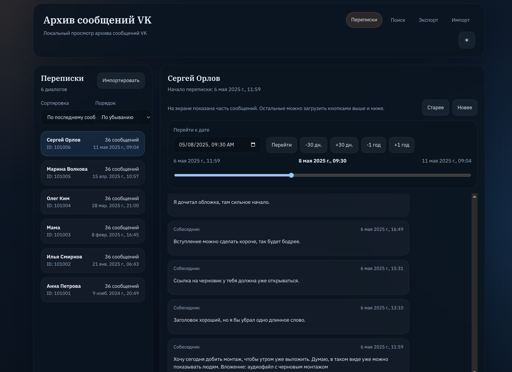

# vk-archive-messages-parser

Локальное офлайн-приложение для архива сообщений VK.

Что это:
- открывает архив сообщений VK в браузере локально, без облака и внешних сервисов;
- импортирует сообщения в SQLite и показывает их по перепискам;
- умеет искать по сообщениям и экспортировать выборку в `txt`, `json`, `jsonl`.



Как запустить:

```bash
make backend ARGS="--config config.toml"
```

После запуска открой `http://127.0.0.1:8001` или адрес из конфига.

Если нужны свои настройки, сначала скопируй пример:

```bash
cp config.example.toml config.toml
```

Для скриншотов можно быстро наполнить базу демо-данными:

```bash
make demo-data ARGS="--config config.toml --reset"
```

Собранный frontend уже лежит в репозитории в `web-out`, поэтому для обычного локального запуска отдельный Node.js не нужен: backend сам раздаёт web UI и API из одного Python-процесса.

Подробная техническая спецификация:
- [docs/tech.md](docs/tech.md)

**Что умеет**
- импортировать архив сообщений VK из локальной директории;
- хранить сообщения в SQLite;
- искать по сообщениям через FTS5, включая обычный и расширенный FTS-поиск;
- показывать переписки через web UI;
- экспортировать сообщения в `txt`, `json`, `jsonl`.

**Что нужно для запуска**
- `uv`
- Python `3.12+`
- `make`

`uv` можно установить по официальной инструкции Astral:
- https://docs.astral.sh/uv/getting-started/installation/

Если Python уже установлен локально, `uv` обычно использует его. Если нет, `uv` умеет ставить Python сам.

**Быстрый старт**
1. Установить `uv`.
2. При необходимости создать локальный конфиг из [config.example.toml](config.example.toml):

```bash
cp config.example.toml config.toml
```

3. Проверить или поправить настройки в `config.toml`.
4. Передать путь к конфигу одним из двух способов:

```bash
export VK_ARCHIVE_CONFIG=config.toml
```

или

```bash
make backend ARGS="--config config.toml"
```

5. Запустить backend, если используется переменная окружения:

```bash
make backend
```

6. Открыть приложение в браузере по адресу из `config.toml`, например:

```text
http://127.0.0.1:8001
```

На первом старте backend:
- проверит наличие базы;
- если файла базы ещё нет, сам применит миграции;
- начнёт раздавать и API, и frontend из `web-out`.

**Импорт сообщений**
1. Открыть приложение.
2. Если переписок ещё нет, UI сразу предложит импорт.
3. Указать путь к корню архива сообщений VK, например `./messages`.
4. Дождаться завершения импорта.

Во время импорта backend пишет структурированные логи:
- какие файлы обработаны;
- какие не обработаны;
- почему произошла ошибка, если она была.

**Конфиг**

Приложение читает TOML-конфиг только если путь передан явно:
- через `VK_ARCHIVE_CONFIG`
- через `--config some_file.toml`

Примеры:

```bash
VK_ARCHIVE_CONFIG=config.toml make backend
make backend ARGS="--config config.toml"
make demo-data ARGS="--config config.toml --reset"
```

Обычно локальный конфиг лежит в корне:
- `config.toml`
- пример: [config.example.toml](config.example.toml)

Ключевые настройки:

```toml
[database]
url = "sqlite:///data/vk_messages.db"

[logging]
level = "INFO"
path = "logs/backend.log"
max_bytes = 1048576
backup_count = 3

[server]
host = "127.0.0.1"
port = 8001
```

`logging.path` — путь к основному лог-файлу.

Ротация простая:
- `max_bytes` — максимальный размер одного файла до ротации;
- `backup_count` — сколько старых файлов хранить.

**Миграции**

Применить миграции вручную:

```bash
make migrate
```

Это запускает `alembic upgrade head`.

Обычно вручную это не нужно, если база создаётся с нуля: backend сам сделает `upgrade head`, когда sqlite-файла ещё нет.

**Проверки**

Тесты backend:

```bash
make tests
```

Линтер backend:

```bash
make lint
```

Форматирование backend:

```bash
make format
```

Проверки перед публикацией:

```bash
make tests
make pre-commit
```

**Публикация на GitHub**

Перед первым публичным пушем стоит проверить следующее:
- в репозиторий не попадают локальные файлы `config.toml`, `data/`, `logs/`, `messages/`;
- в `config.example.toml` лежат только безопасные значения по умолчанию;
- для скриншотов и демо используется синтетическая база через `make demo-data ARGS="--reset"`;
- если менялся frontend, перед публикацией нужно пересобрать `web-out`;
- `README` и лицензия соответствуют тому, что реально лежит в репозитории.

**Структура проекта**
- `backend/` — FastAPI, импорт, поиск, экспорт, работа с БД
- `deploy/migrations/` — Alembic-миграции
- `messages/` — примеры архивных данных
- `web/` — исходники frontend
- `web-out/` — собранный frontend, который раздаёт backend
- `docs/tech.md` — подробная техническая спецификация
